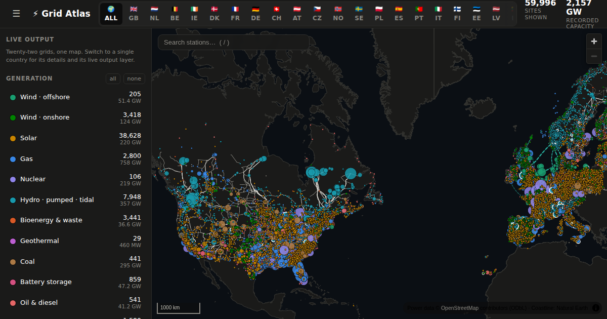

# ⚡ Grid Atlas — 🇬🇧 🇳🇱 🇧🇪 🇮🇪 🇩🇰 🇫🇷 🇩🇪

**Live site → [jacobwright32.github.io/uk-grid-atlas](https://jacobwright32.github.io/uk-grid-atlas/)**
[](https://github.com/jacobwright32/uk-grid-atlas/actions/workflows/ci.yml)
[](https://github.com/jacobwright32/uk-grid-atlas/actions/workflows/deploy.yml)

[](https://jacobwright32.github.io/uk-grid-atlas/)

An interactive, dark-mode map of the United Kingdom's electricity system: every
utility-scale generation site, the 400/275 kV transmission backbone (plus
Scotland's 132 kV network), and the HVDC interconnectors that tie GB to its
neighbours.

Built with **React 19 + TypeScript (strict) + Vite + MapLibre GL JS** — WebGL
rendering, Google-Maps-style pan/zoom, no API keys required.

## Features

- **~4,000 generation sites** — nuclear, gas, offshore/onshore wind, solar,
  hydro, pumped storage, bioenergy, battery storage and more — each sized by
  installed capacity and coloured by fuel. Hover for a card with capacity,
  operator and commissioning date; click to pin it.
- **The high-voltage network** — 400 kV and 275 kV circuits across GB,
  132 kV in Scotland (where it is transmission voltage), and Northern
  Ireland's 275 kV ring, styled by voltage class.
- **HVDC links** — all operational interconnectors (France, Belgium, the
  Netherlands, Norway, Denmark, Ireland) plus intra-GB reinforcements
  (Western Link, Caithness–Moray, Shetland) and under-construction links
  (Eastern Green Links, NeuConnect) shown dashed/faded.
- **Legend-as-filter** — toggle any fuel group or network class; headline
  counts and GW totals track what's visible.
- **Live output layer (Elexon)** — per-station figures from the free,
  key-less Elexon Insights API, fetched directly by the browser (the API is
  CORS-open): scheduled output *right now* (PN), the latest fully-metered
  day (B1610: average/peak/energy + a half-hourly sparkline and load factor
  in every hover card), live interconnector flows on the HVDC lines, and a
  national transmission-mix strip. Dots resize by live output (bright) over
  capacity (ghost); toggle it off in the sidebar.
- **Self-contained dark basemap** (Natural Earth coastline) with an optional
  online CARTO raster underlay for street-level context.

## Quick start

```bash
npm install
npm run dev        # http://localhost:5173
```

```bash
npm run build      # production build → dist/
npm run preview    # serve the production build locally
```

Deploy `dist/` to any static host, or:

```bash
docker build -t uk-grid-atlas . && docker run -p 8080:80 uk-grid-atlas
```

### Deploying (free)

The build is fully static — any static host works, no server or keys needed.

- **GitHub Pages (included):** push this repo to GitHub (public), then in the
  repo go to *Settings → Pages* and set **Source: GitHub Actions**. The
  bundled `.github/workflows/deploy.yml` builds and publishes on every push
  to `main`; your site appears at `https://<user>.github.io/<repo>/`.
- **Netlify:** `npm run build`, then drag the `dist/` folder onto
  [app.netlify.com/drop](https://app.netlify.com/drop) — instant URL, no git.
- **Cloudflare Pages:** connect the repo, build command `npm run build`,
  output directory `dist` — unlimited free bandwidth, free custom domains.

The `base: './'` in `vite.config.ts` makes the same build work at a domain
root, under a subpath, or opened from disk. If you deploy publicly, keep the
map's attribution control visible (OSM ODbL requirement).

### Single-file build

`npm run build:single` emits `dist-single/index.html` — the entire app
(code, styles **and data**) inlined into one HTML file that runs from disk
with no server. Useful for sharing and offline use.

## Data pipeline

Pre-built GeoJSON ships in `src/data/`, so the app builds without network
access. To refresh from source:

```bash
npm run data:fetch          # download GB raw extracts from Overpass (mirrors, retried)
node scripts/build-data.mjs gb   # → src/data/gb/*.json
node scripts/build-data.mjs nl   # → src/data/nl/*.json (raw NL extracts via Overpass or
                                 #   scripts/pbf-extract-lines.py on a Geofabrik .osm.pbf)
```

The app is multi-country: a header switcher (or `#nl`, `#be`, `#ie`, `#dk`,
`#fr`, `#de` in the URL) swaps data bundles, map bounds and voltage tiers per
country. Seven grids ship today: Great Britain (400/275/132 kV), the
Netherlands (380/220/150/110), Belgium (380/220/150), the island of Ireland
(400/275/220/110 — the SEM is mapped as one grid), Denmark (400/150/132),
France (400/225; the huge 90/63 kV layer is omitted) and Germany (380/220;
110 kV omitted). Each country is ~30 lines of config in
`scripts/build-data.mjs` + `src/lib/countries.ts` plus its raw extracts —
adding another is an afternoon, not a project. The live Elexon layer is
GB-only; European countries would use ENTSO-E (roadmap).

| Layer | Source | Notes |
|---|---|---|
| Generation sites | OpenStreetMap `power=plant` via Overpass | UK admin area + offshore bounding boxes; near-duplicates de-duplicated by name; foreign offshore farms excluded by heuristic |
| Wind on/offshore split | Computed | Point-in-polygon against Natural Earth 1:10m land |
| Transmission lines | OpenStreetMap `power=line` | `voltage` ≥ 275 kV UK-wide, ≥ 132 kV within Scotland; geometry simplified (RDP, ~25 m) |
| Interconnectors / HVDC | Curated (`scripts/interconnectors.mjs`) | OSM submarine coverage is patchy, so routes are schematic; capacities/status from operator publications — update there |
| Coastline | Natural Earth 1:10m (via `world-atlas`) | Clipped to NW Europe, simplified |
| BMU → station map | Elexon `reference/bmunits/all` + `scripts/build-bmu-map.mjs` | Fuzzy name match with fuel-type guards + manual overrides; ~87% of BM-registered capacity mapped (rest is mostly retired plant) |
| Live output | Elexon Insights API (browser-side) | B1610 per-unit metered actuals (published ~a week behind), PN scheduled levels (now), `generation/outturn/summary` mix; snapshot baked by `scripts/fetch-live-snapshot.mjs` for offline |

**Licences:** power data © OpenStreetMap contributors, ODbL; Natural Earth is
public domain. Keep the attribution control visible if you deploy this.

### Known data caveats

- OSM capacity tags (`plant:output:electricity`) are missing for some sites —
  GW totals understate reality and are labelled "recorded capacity".
- A few wind farms exist in OSM as both an umbrella site and per-phase
  entries under different names (e.g. "Walney" phases); exact-name
  de-duplication keeps both, so site counts can slightly double-count phases.
- Northern Ireland's 110 kV network and GB distribution (≤132 kV England &
  Wales) are intentionally out of scope.
- Live per-station data exists only for BM-registered (mostly
  transmission-connected) units — roughly 70–80% of GB generation but a
  minority of *sites*. Embedded solar and small wind have no public
  per-site feed; their hover cards say so. "Now" figures are the unit's
  own submitted schedule (PN), not metered output; metered actuals (B1610)
  lag by about a week. NI stations settle in the SEM, not BM, so they have
  no live layer either.

## Architecture

```
src/
  App.tsx               shell: header stats, sidebar, map pane
  components/
    GridMap.tsx         MapLibre lifecycle, layers, hover/pin interactions
    Sidebar.tsx         legend-as-filter, network toggles, about
  map/
    style.ts            self-contained dark base style (+ CARTO underlay slot)
    layers.ts           layer/paint specs (capacity-scaled circles, voltage widths)
    popup.ts            hover cards, built with DOM APIs (no innerHTML)
  lib/
    types.ts            data model (GeoJSON property contracts)
    fuels.ts            fuel taxonomy, colour system, legend groups
    filter.ts           pure filter/stats logic (unit-tested)
    format.ts           number/label formatting (unit-tested)
  hooks/useGridData.ts  loads GeoJSON bundles (?url assets → fetch)
  data/                 pre-built GeoJSON (generated — do not hand-edit)
scripts/
  fetch-overpass.mjs    reproducible raw-data download (mirrors, retries, cache)
  build-data.mjs        raw → app GeoJSON (dedupe, classify, simplify)
  interconnectors.mjs   curated HVDC link registry
  pipeline-utils.mjs    pure helpers (unit-tested)
```

Design decisions worth knowing:

- **Colour system.** The eight primary fuel colours are the validated
  dark-mode categorical slots of the project's design reference palette
  (lightness band, chroma floor and ≥3:1 contrast on `#1a1a19` hold as a
  set). With ten identity colours on one map, an all-pairs colour-vision
  guarantee is mathematically unreachable — so identity never rides on colour
  alone: every mark has a hover card naming its fuel, the legend is always
  visible, fuel filters act as on-demand faceting, and pumped storage carries
  a white ring as a secondary encoding.
- **No clustering.** Capacity-scaled radii mean the ~50 big stations carry
  the national view while thousands of small solar farms stay subtle until
  you zoom — closer to how the grid actually works than cluster bubbles.
- **Popups are DOM-built** (`textContent`, never `innerHTML`) because names
  and operators are free-text OSM tags.
- **The basemap needs no network** — Natural Earth polygons render the
  coastline, so the single-file build works fully offline; online raster
  tiles are an optional enhancement, off by default there.

## Scripts

| Command | What it does |
|---|---|
| `npm run dev` | Vite dev server with HMR |
| `npm run build` | Type-check + production build |
| `npm run build:single` | Self-contained single-file build |
| `npm run test` | Vitest unit tests (lib + pipeline) |
| `npm run lint` | oxlint |
| `npm run format` | Prettier |
| `npm run data:fetch` / `data:build` | Refresh the dataset |

## Environment

| Variable | Effect |
|---|---|
| `VITE_DEFAULT_TILES=1` | Start with the online CARTO raster underlay enabled |

---

*Data extract date is shown in the sidebar. Power data © OpenStreetMap
contributors (ODbL) · Coastline: Natural Earth · Interconnector registry
curated from operator publications.*
