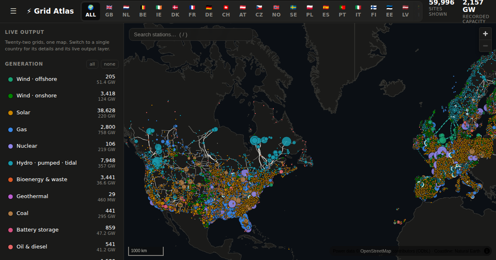

# ⚡ Grid Atlas — 🇬🇧 🇳🇱 🇧🇪 🇮🇪 🇩🇰 🇫🇷 🇩🇪 🇨🇭 🇦🇹 🇨🇿 🇳🇴 🇸🇪 🇫🇮 🇵🇱 🇪🇸 🇵🇹 🇮🇹 🇪🇪 🇱🇻 🇱🇹 🇺🇸 🇨🇦 🌍

**Live site → [jacobwright32.github.io/uk-grid-atlas](https://jacobwright32.github.io/uk-grid-atlas/)**
[](https://github.com/jacobwright32/uk-grid-atlas/actions/workflows/ci.yml)
[](https://github.com/jacobwright32/uk-grid-atlas/actions/workflows/deploy.yml)

[](https://jacobwright32.github.io/uk-grid-atlas/)

An interactive, dark-mode atlas of power grids — Great Britain in full detail,
nineteen European countries, the United States, Canada, and a transatlantic ALL view:
tens of thousands of utility-scale generation sites, each country's
high-voltage transmission backbone, and the HVDC interconnectors that tie
the grids together.

Built with **React 19 + TypeScript (strict) + Vite + MapLibre GL JS** — WebGL
rendering, Google-Maps-style pan/zoom, no API keys required.

## Features

- **~60,000 generation sites across thirty-one grids on two continents** —
  nuclear, gas, offshore/onshore wind, solar, hydro, pumped storage,
  bioenergy, geothermal, battery storage and more — each sized by installed
  capacity and coloured by fuel. Hover for a card with capacity, operator
  and commissioning date; click to pin it. Station search on `/`.
- **The transmission backbone of every grid** — from Hydro-Québec's 735 kV
  to the Baltic 330 kV standard, styled by voltage class and streamed from
  a single PMTiles vector archive (only the tiles in view download).
- **55 HVDC links** — every operational interconnector plus in-country
  reinforcements and under-construction links (dashed/faded). Links with a
  known flow glow teal (importing) or amber (exporting), width tracking
  utilisation.
- **Live output, five sources, zero API keys in the browser** — GB per
  station via Elexon (PN right now + the metered day, half-hourly); 19
  European countries per station/mix via ENTSO-E snapshots; Ontario per
  station via IESO's public report; Texas + New York fuel mixes via ERCOT
  and NYISO. Refreshed every 6 hours by a scheduled workflow. Dots resize
  by live output (bright) over capacity (ghost).
- **Scrub the metered day** — a time slider plays any grid's day back:
  station dots, the mix strip, HVDC flows and the wholesale-price line all
  follow the slider. The default view shows _today so far_, hours old.
- **Wholesale prices** — ENTSO-E day-ahead per bidding zone (averaged for
  multi-zone countries) and GB's market-index price, in the mix strip.
- **Legend-as-filter** — toggle any fuel group or network class; headline
  counts and GW totals track what's visible.
- **Self-contained dark basemap** (Natural Earth coastline) with an optional
  online CARTO raster underlay for street-level context.

## Use the data from Python

The JSON this atlas publishes is a public API, and
[**world-energy-generation**](https://pypi.org/project/world-energy-generation/)
is the Python client for it — generation, prices, cross-border flows and demand
for all thirty-one grids, with no key and no required dependencies.

```bash
pip install world-energy-generation
```

```python
import world_energy_generation as weg

weg.latest("de").mix["wind"]                       # 11901.0 MW
weg.generation(["de", "fr", "no"])                 # tidy DataFrame, needs [pandas]
```

Source is in [`python/`](python/), docs in [`python/README.md`](python/README.md).
Worth reading before you publish a number: an absent fuel bucket means *not
reported*, not zero; `us` is ERCOT + NYISO rather than the whole country; and
carbon intensity is derived here from lifecycle factors, not measured upstream.

## Quick start

```bash
npm install
npm run dev        # http://localhost:5173
```

```bash
npm run build      # production build → dist/
npm run preview    # serve the production build locally
```

Deploy `dist/` to any static host, or:

```bash
docker build -t uk-grid-atlas . && docker run -p 8080:80 uk-grid-atlas
```

### Deploying (free)

The build is fully static — any static host works, no server or keys needed.

- **GitHub Pages (included):** push this repo to GitHub (public), then in the
  repo go to _Settings → Pages_ and set **Source: GitHub Actions**. The
  bundled `.github/workflows/deploy.yml` builds and publishes on every push
  to `main`; your site appears at `https://<user>.github.io/<repo>/`.
- **Netlify:** `npm run build`, then drag the `dist/` folder onto
  [app.netlify.com/drop](https://app.netlify.com/drop) — instant URL, no git.
- **Cloudflare Pages:** connect the repo, build command `npm run build`,
  output directory `dist` — unlimited free bandwidth, free custom domains.

The `base: './'` in `vite.config.ts` makes the same build work at a domain
root, under a subpath, or opened from disk. If you deploy publicly, keep the
map's attribution control visible (OSM ODbL requirement).

### Single-file build

`npm run build:single` emits `dist-single/index.html` — the entire app
(code, styles **and data**) inlined into one HTML file that runs from disk
with no server. Useful for sharing and offline use.

## Data pipeline

Pre-built GeoJSON ships in `src/data/`, so the app builds without network
access. To refresh from source:

```bash
npm run data:fetch -- gb    # download raw extracts from Overpass (mirrors, retried). Fourteen
                            #   grids have queries: gb | no | se | pl | pt | fi | ch | at | cz |
                            #   ee | lv | lt | es | it — or `all` to walk every one of them.
node scripts/build-data.mjs gb   # → src/data/gb/*.json
node scripts/build-data.mjs nl   # → src/data/nl/*.json (nl is one of the eight grids with no
                                 #   Overpass query — its raw extracts come from a Geofabrik
                                 #   .osm.pbf, see "Extracting from a Geofabrik PBF" below)
npm run data:slim                # shrink committed bundles (drop sub-threshold noise)
npm run data:tiles               # → public/tiles/transmission.pmtiles (re-run after any
                                 #   build-data refresh; needs tippecanoe — macOS:
                                 #   `brew install tippecanoe`, Debian/Ubuntu: build from
                                 #   https://github.com/felt/tippecanoe)
```

Transmission lines render from a single committed [PMTiles](https://github.com/protomaps/PMTiles)
archive — the browser range-requests only the tiles in view, so no client
ever downloads the full 20 MB of line geometry. Stations stay GeoJSON
(search, stats and the live layer need them in memory). The single-file
build keeps the old GeoJSON line bundles so it stays truly self-contained.

The app is multi-country: a header switcher (or `#nl`, `#be`, `#ie`, `#dk`,
`#fr`, `#de`, `#ch`, `#at`, `#cz`, `#si`, `#hu`, `#sk`, `#hr`, `#bg`, `#gr`, `#ro`, `#ba`, `#rs`, `#no`, `#se`, `#fi`, `#pl`, `#es`, `#pt`, `#it`, `#ee`, `#lv`, `#lt`, `#us`, `#ca`, `#all` in the URL)
swaps data bundles, map bounds and voltage tiers per country. Thirty-one grids
ship today: Great Britain (400/275/132 kV), the Netherlands
(380/220/150/110), Belgium (380/220/150), the island of Ireland
(400/275/220/110 — the SEM is mapped as one grid), Denmark (400/150/132),
France (400/225; the huge 90/63 kV layer is omitted), Germany (380/220;
110 kV omitted), Switzerland (380/220; cantonal 110 kV and the SBB 16.7 Hz
railway grid omitted), Austria (380/220; regional 110 kV and the ÖBB
railway grid omitted), Czechia (400/220; 110 kV omitted), Slovenia
(400/220/110 — 110 kV is transmission voltage there, as in Finland),
Hungary (400/220; the 120 kV layer is barely mapped in OSM, and the single 750 kV line to Ukraine is omitted), Slovakia (400/220/110), Croatia (400/220/110), Bulgaria (400/220/110), Greece (400/150 — Portugal's shape; island 66 kV systems omitted), Romania (400/220/110), Bosnia and Herzegovina (400/220/110 — generation and demand but no wholesale prices), Serbia (400/220/110 — mix only, no per-unit output), Norway (420/300/132), Sweden (400/220/130), Poland
(400/220; 110 kV omitted), Spain (400/220; regional networks omitted),
Portugal (400/220/150), Finland (400/220/110 — 110 kV is transmission
voltage there), Italy (380/220; the vast 150 kV layer is omitted), Estonia, Latvia and
Lithuania (330/110 — the ex-Soviet Baltic standard, synchronised with
Continental Europe since February 2025), the United States
(765/500/345/230 kV, CONUS) and Canada (735/500/315/230–240 —
Hydro-Québec's 735 kV network plus the Nelson River, Québec–New England,
Labrador–Island and Maritime HVDC links) — plus a transatlantic ALL view that merges the
lot. Each country is ~30 lines of config in `scripts/build-data.mjs` +
`src/lib/countries.ts` plus its raw extracts — adding another is an
afternoon, not a project. Live output: GB via Elexon (browser-side); every
European grid via ENTSO-E snapshots (the Nordics and Italy are mix-only —
their TSOs publish little per-unit data); Ontario per station via IESO's
public report; Texas + New York fuel mixes via ERCOT and NYISO — every
source free and key-less (only the workflow's ENTSO-E token needs a free
account). Grids whose mappers tag single turbines instead of farms
(FI/AT/EE/CA) get synthetic wind-farm stations via
`scripts/pbf-extract-generators.py` + `scripts/cluster-wind.mjs`.

| Layer                    | Source                                                       | Notes                                                                                                                                                                                        |
| ------------------------ | ------------------------------------------------------------ | -------------------------------------------------------------------------------------------------------------------------------------------------------------------------------------------- |
| Generation sites         | OpenStreetMap `power=plant` via Overpass or PBF              | Admin area + offshore bounding boxes; near-duplicates de-duplicated by name; foreign offshore farms excluded by heuristic — every tag read is listed in [docs/osm-tags.md](docs/osm-tags.md) |
| Wind farms (FI/AT/EE/CA) | OpenStreetMap `power=generator` via PBF                      | Individually mapped turbines clustered into synthetic farm stations (`cluster-wind.mjs`)                                                                                                     |
| Wind on/offshore split   | Computed                                                     | Point-in-polygon against Natural Earth 1:10m land                                                                                                                                            |
| Transmission lines       | OpenStreetMap `power=line`                                   | `voltage` ≥ 275 kV UK-wide, ≥ 132 kV within Scotland; per-country voltage ladders in [docs/osm-tags.md](docs/osm-tags.md); geometry simplified (RDP, ~25 m)                                  |
| Interconnectors / HVDC   | Curated (`scripts/interconnectors.mjs`)                      | OSM submarine coverage is patchy, so routes are schematic; capacities/status from operator publications — update there                                                                       |
| Coastline                | Natural Earth 1:10m (via `world-atlas`)                      | Two region bundles (Europe/Africa + Americas), antimeridian-safe rectangle clip, simplified — regenerate with `npm run data:basemap`                                                         |
| BMU → station map        | Elexon `reference/bmunits/all` + `scripts/build-bmu-map.mjs` | Fuzzy name match with fuel-type guards + manual overrides; ~87% of BM-registered capacity mapped (rest is mostly retired plant)                                                              |
| Live output (GB)         | Elexon Insights API (browser-side)                           | B1610 per-unit metered actuals (published ~a week behind), PN scheduled levels (now), `generation/outturn/summary` mix; snapshot baked by `scripts/fetch-live-snapshot.mjs` for offline      |
| Live output (EU)         | ENTSO-E Transparency API (scheduled workflow)                | A73 per-unit day series mapped to stations, A75 daily mix, A11 HVDC border flows → committed to `public/live/<cc>.json` every 6 h by `.github/workflows/live-snapshots.yml`                  |
| Live output (Canada)     | IESO Generator Output & Capability report (public, key-less) | Per-generator hourly XML → Ontario per-station day series + today-so-far mix, same snapshot shape as the EU                                                                                  |
| Live output (US)         | ERCOT fuel-mix JSON + NYISO rtfuelmix CSV (public, key-less) | Texas + New York hourly fuel mixes (≈⅓ of US generation), mix-only — no US ISO publishes per-plant output openly                                                                             |
| Wholesale prices         | ENTSO-E A44 day-ahead + Elexon MID (GB)                      | Per bidding zone, averaged for multi-zone countries; today's prices ship with the snapshot (known since yesterday's auction)                                                                 |
| Transmission tiles       | `scripts/build-tiles.mjs` (tippecanoe → PMTiles)             | All 22 countries' lines in one committed range-requested archive; re-run after any `build-data` refresh                                                                                      |

**Licences:** power data © OpenStreetMap contributors, ODbL; Natural Earth is
public domain. Keep the attribution control visible if you deploy this.

### Extracting from a Geofabrik PBF

Overpass is the convenient path but not the universal one. Only fourteen of
the thirty-one grids have queries in `scripts/fetch-overpass.mjs` — `gb`, `no`,
`se`, `pl`, `pt`, `fi`, `ch`, `at`, `cz`, `ee`, `lv`, `lt`, `es`, `it`. The
other seventeen — **`nl`, `be`, `ie`, `dk`, `fr`, `de`, `si`, `hu`, `sk`, `hr`, `bg`, `gr`, `ro`, `ba`, `rs`, `ca`, `us`** — have none at
all: most are too big for public Overpass servers to hand out (the US
alone is 36k line segments), so their raw extracts are cut locally from a
Geofabrik country download. The 2026 adds (Slovenia onward) are smaller but
use the PBF path regardless, because it is now the more reliable of the two. Several Overpass countries also carry a
`plants_<cc>_pbf.json` alongside their query results, because a local extract
catches plants the area query missed.

The only prerequisite is [PyOsmium](https://osmcode.org/pyosmium/):

```bash
pip install osmium
curl -O https://download.geofabrik.de/europe/netherlands-latest.osm.pbf
```

[download.geofabrik.de](https://download.geofabrik.de) publishes a daily
`.osm.pbf` per country (and per US/Canada state or province). The three
extractors each emit exactly the Overpass element shape `build-data.mjs`
already consumes — `out tags center` for plants, `out tags geom` for lines —
so nothing downstream knows or cares which path a file came from:

```bash
# plants: power=plant nodes, ways and relations, centroided
python3 scripts/pbf-extract-plants.py netherlands-latest.osm.pbf ../data/nl_plants.json

# lines: power=line ways, filtered by a voltage regex (3rd arg, required)
python3 scripts/pbf-extract-lines.py netherlands-latest.osm.pbf \
  ../data/nl_lines_pbf.json "380000|220000|150000|110000"

# turbines: power=generator wind, for grids with no farm polygons (FI/AT/EE/CA)
python3 scripts/pbf-extract-generators.py finland-latest.osm.pbf ../data/gens_fi_wind.json
node scripts/build-data.mjs fi     # cluster-wind reads the stations it produces
node scripts/cluster-wind.mjs fi   # → ../data/plants_fi_wind_clusters.json
node scripts/build-data.mjs fi     # again, now folding the synthetic farms in
```

Filenames are a contract, not a convention: `build-data.mjs` looks for the
literal names in each country's `plantFiles` / `seaFiles`, and for any file in
the raw directory matching its `lineFile` regex. In practice that means
`plants_<cc>_pbf.json` for plants, `<cc>_lines_pbf.json` for lines (GB is the
odd one out — its regex wants `lines_*.json`), `gens_<cc>_wind.json` for
turbines and `plants_<cc>_wind_clusters.json` for the clustered output. The
Netherlands predates the convention and wants `nl_plants.json`. When in doubt,
read the country's entry in `COUNTRIES` — that list _is_ the spec. The raw
directory defaults to `../data` (a sibling of the repo, so multi-gigabyte PBFs
never land in git); every script takes an override as its last positional
argument.

Pick the voltage regex from the country's `classify` ladder — everything it
maps to a class, and nothing below. The per-country ladders are tabulated in
[docs/osm-tags.md](docs/osm-tags.md#voltage--line-class--tier); for the US that
is `"765000|500000|345000|230000"`, for Germany `"380000|220000"`.

### Improving the data (a note for OSM mappers)

Everything on this map is OpenStreetMap data — improving OSM improves the
atlas directly (bundles are rebuilt from fresh extracts periodically). The
tags the pipeline reads, in order of how much they help:

1. **`plant:output:electricity`** on `power=plant` — capacity, the single
   most valuable tag. Use explicit units (`460 MW`, `12.5 MW`); unrecorded
   capacity understates national GW totals and shrinks the site's dot.
2. **`name`** — unnamed plants can't be matched to live output feeds, so
   they never light up. Official names beat descriptions.
3. **`plant:source`** — drives the fuel colour/filters (`wind`, `solar`,
   `hydro`, `gas`, `coal`, `nuclear`, `geothermal`, `biomass`, `waste`,
   `battery`, `oil`, `tidal`…).
4. **`plant:method`** — any value containing `pumped` moves a hydro site into
   the pumped-storage class and gives it the white-ring marker.
5. **`operator`** and **`start_date`** — shown on every hover card.
6. **`voltage`** on `power=line` — the transmission layer keys entirely off
   this (semicolon-separated lists are handled).

Every station's hover card links back to its OSM element, so fixing a wrong
capacity is two clicks away. The [MapYourGrid](https://mapyourgrid.org)
initiative and [Open Infrastructure Map](https://openinframap.org) are good
companions for grid-mapping conventions.

That is the short list, ordered by leverage. **[docs/osm-tags.md](docs/osm-tags.md)
is the full reference** — every Overpass selector, every tag key the builder
reads and what it drives, the complete 27-value `plant:source` → fuel-group
table, the `power=generator` family, the per-country voltage ladders, and
exactly what degrades when a tag is missing.

### Known data caveats

- OSM capacity tags (`plant:output:electricity`) are missing for some sites —
  GW totals understate reality and are labelled "recorded capacity".
- A few wind farms exist in OSM as both an umbrella site and per-phase entries
  under different names (e.g. "Walney" phases). The builder now folds phase and
  variant spellings together ("Hornsea One" / "Hornsea 1" / "Hornsea Project
  One") when the two features sit close enough to be the same site, summing
  distinct builds ("Walney" + "Walney Extension") and counting mere aliases
  once. Genuinely different phases stay separate, as do descriptive variants
  ("Drax" vs "Drax Bioenergy"), so a little double-counting remains. The fold
  happens at build time: the `src/data/**` bundles in the repo only pick it up
  at the next rebuild.
- Northern Ireland's 110 kV network and GB distribution (≤132 kV England &
  Wales) are intentionally out of scope.
- Live per-station data exists only for BM-registered (mostly
  transmission-connected) units — roughly 70–80% of GB generation but a
  minority of _sites_. Embedded solar and small wind have no public
  per-site feed; their hover cards say so. "Now" figures are the unit's
  own submitted schedule (PN), not metered output; metered actuals (B1610)
  lag by about a week. NI stations settle in the SEM, not BM, so they have
  no live layer either.

### European live layer (ENTSO-E) — one-time setup

The EU live layer is up and refreshing 6-hourly in this repo. For forks (or
if the token is ever rotated), the one-time setup:

1. Register at [transparency.entsoe.eu](https://transparency.entsoe.eu) (free).
2. In _My Account Settings_, generate a **Web API Security Token** (if the
   option isn't shown, email transparency@entsoe.eu with subject
   "Restful API access" and your account email — they enable it within a day).
3. In your GitHub repo: _Settings → Secrets and variables → Actions →
   New repository secret_ — name `ENTSOE_TOKEN`, value = the token.
4. _Actions → Refresh European live snapshots → Run workflow_ (it also runs
   itself every 6 hours from then on).

Each run finds the latest metered day per country, maps generation units to
map stations (`data/entsoe-maps/`, matched by a multilingual name tokeniser —
check `unmatchedTop` there and add overrides in `<cc>-overrides.json` if a
big plant is missed; overrides win over cached matches), commits fresh
snapshots, and dispatches a site deploy so they go live. Without a token the
script exits cleanly and the sidebar says the snapshot is awaited.

## Architecture

```
src/
  App.tsx               shell: header stats, sidebar, map pane
  components/
    GridMap.tsx         MapLibre lifecycle, layers, hover/pin interactions
    Sidebar.tsx         legend-as-filter, network toggles, about
  map/
    style.ts            self-contained dark base style (+ CARTO underlay slot)
    layers.ts           layer/paint specs (capacity-scaled circles, voltage widths)
    popup.ts            hover cards, built with DOM APIs (no innerHTML)
  lib/
    types.ts            data model (GeoJSON property contracts)
    fuels.ts            fuel taxonomy, colour system, legend groups
    filter.ts           pure filter/stats logic (unit-tested)
    format.ts           number/label formatting (unit-tested)
  hooks/useGridData.ts  loads GeoJSON bundles (?url assets → fetch)
  data/                 pre-built GeoJSON (generated — do not hand-edit)
scripts/
  fetch-overpass.mjs    reproducible raw-data download (mirrors, retries, cache)
  pbf-extract-plants.py    power=plant → Overpass-shaped JSON, from a Geofabrik PBF
  pbf-extract-lines.py     power=line (voltage-filtered) → Overpass-shaped JSON
  pbf-extract-generators.py  power=generator wind turbines, for farm-less grids
  cluster-wind.mjs      turbines → synthetic farm stations (FI/AT/EE/CA)
  build-data.mjs        raw → app GeoJSON (dedupe, classify, simplify)
  interconnectors.mjs   curated HVDC link registry
  basemap.mjs           region coastline builder (antimeridian-safe clipping)
  live-matching.mjs     multilingual unit/station name matching (unit-tested)
  entsoe.mjs            ENTSO-E API client + document parsing
  fetch-entsoe-snapshot.mjs   bake EU live snapshots (Actions, 6-hourly)
  fetch-live-snapshot.mjs     bake the offline GB snapshot
  build-bmu-map.mjs     GB BMU → station map
  pipeline-utils.mjs    pure helpers (unit-tested)
docs/
  osm-tags.md           every OSM tag the pipeline reads, and what it drives
```

Design decisions worth knowing:

- **Colour system.** The eight primary fuel colours are the validated
  dark-mode categorical slots of the project's design reference palette
  (lightness band, chroma floor and ≥3:1 contrast on `#1a1a19` hold as a
  set). With ten identity colours on one map, an all-pairs colour-vision
  guarantee is mathematically unreachable — so identity never rides on colour
  alone: every mark has a hover card naming its fuel, the legend is always
  visible, fuel filters act as on-demand faceting, and pumped storage carries
  a white ring as a secondary encoding.
- **No clustering.** Capacity-scaled radii mean the ~50 big stations carry
  the national view while thousands of small solar farms stay subtle until
  you zoom — closer to how the grid actually works than cluster bubbles.
- **Popups are DOM-built** (`textContent`, never `innerHTML`) because names
  and operators are free-text OSM tags.
- **The basemap needs no network** — Natural Earth polygons render the
  coastline, so the single-file build works fully offline; online raster
  tiles are an optional enhancement, off by default there.

## Scripts

| Command                                                            | What it does                                                                                                                                 |
| ------------------------------------------------------------------ | -------------------------------------------------------------------------------------------------------------------------------------------- |
| `npm run dev`                                                      | Vite dev server with HMR                                                                                                                     |
| `npm run build`                                                    | Type-check + production build                                                                                                                |
| `npm run build:single`                                             | Self-contained single-file build                                                                                                             |
| `npm run test`                                                     | Vitest unit tests (lib + pipeline)                                                                                                           |
| `npm run lint`                                                     | oxlint                                                                                                                                       |
| `npm run format`                                                   | Prettier                                                                                                                                     |
| `npm run data:fetch` / `data:build`                                | Refresh the dataset                                                                                                                          |
| `python3 scripts/pbf-extract-plants.py <pbf> <out>`                | `power=plant` out of a Geofabrik `.osm.pbf` (needs `pip install osmium`)                                                                     |
| `python3 scripts/pbf-extract-lines.py <pbf> <out> <voltage-regex>` | `power=line` at the given voltages, same PBF prerequisite                                                                                    |
| `python3 scripts/pbf-extract-generators.py <pbf> <out>`            | Wind `power=generator` turbines, for `cluster-wind.mjs`                                                                                      |
| `node scripts/cluster-wind.mjs <cc>`                               | Cluster those turbines into synthetic farm stations                                                                                          |
| `npm run data:basemap`                                             | Rebuild just the coastline bundles from Natural Earth                                                                                        |
| `npm run data:bmumap`                                              | Rebuild the GB BMU → station map (Elexon registry)                                                                                           |
| `npm run data:snapshot`                                            | Bake the offline GB live snapshot                                                                                                            |
| `npm run live:snapshots`                                           | Fetch ENTSO-E snapshots for all EU countries (needs `ENTSOE_TOKEN`)                                                                          |
| `npm run data:snapshot:ca` / `:us`                                 | Bake the Ontario (IESO) and Texas+New York (ERCOT+NYISO) snapshots                                                                           |
| `npm run data:history:gb`                                          | Bake GB mix/price history from Elexon (key-less)                                                                                             |
| `npm run data:slim` / `data:tiles`                                 | Shrink bundles / rebuild the PMTiles transmission archive                                                                                    |
| `node shot-batch1.mjs`                                             | Regenerate the social card `public/og.png` — needs `npm run preview` running first, since it screenshots `localhost:4173` (no npm alias yet) |

## Environment

| Variable               | Effect                                              |
| ---------------------- | --------------------------------------------------- |
| `VITE_DEFAULT_TILES=1` | Start with the online CARTO raster underlay enabled |

---

_Data extract date is shown in the sidebar. Power data © OpenStreetMap
contributors (ODbL) · Coastline: Natural Earth · Interconnector registry
curated from operator publications._
